# Hands-On FreeRTOS 🖥️
The following is a repository that contains the exploration of Real-Time Operating Systems (RTOS) based on a Udemy course: [Mastering RTOS: Hands on FreeRTOS and STM32Fx with Debugging](https://www.udemy.com/course/mastering-rtos-hands-on-with-freertos-arduino-and-stm32fx/?utm_source=adwords&utm_medium=udemyads&utm_campaign=Webindex_Catchall_la.EN_cc.CA&utm_term=_._ag_119831896715_._ad_533102824920_._kw__._de_c_._dm__._pl__._ti_dsa-21781902600_._li_9000965_._pd__._&matchtype=&gad_source=1&gclid=CjwKCAiArLyuBhA7EiwA-qo80N3YBt89oN_fUM4my-SwgprhOUh4ZP6upBo_oo2izcF-jyFWsJuC1xoCG_QQAvD_BwE)

# Topics 📃
The topics in this repository include:
* Learn Complete Step by step method to run FreeRTOS on STM32 MCUs using OpenSTM32 System Workbench
* Using STM32 Standard Peripheral Driver APIs to configure peripherals
* FreeRTOS Task Creation , Deletion, Scheduling using with code examples
* Important scheduling policies of FreeRTOS Scheduler
* FreeRTOS Stack and Heap Management
* Right ways of Synchronizing between tasks using Semaphores.
* Right ways of Synchronizing between a task and an interrupt using semaphores
* Synchronization between multiple events and a task
* FreeRTOS Queue management like creation, sending, receiving, blocking, etc
* Implementing mutual exclusion between Tasks using Mutex services and semaphores
* Understanding Context Switching with in detail code explanation
* Understanding Architecture specific codes like SVC_handler, PendSV_handler, SysTick Handler line by line
* You will learn about kernel Tick timer, its importance, the kernel tick frequency and its configuration details.
* Understanding complete ARM Cortex M and FreeRTOS Priority model and its configuration related informations
* FreeRTOS Debugging using SEGGER SystemView Software
* Low power instructions use case in FreeRTOS scenario

# Tools 🔨
* [STM32CubeIDE](https://www.st.com/en/development-tools/stm32cubeide.html)
* [NUCLEO-F767ZI](https://www.st.com/en/evaluation-tools/nucleo-f767zi.html)
* [FreeRTOS](https://www.freertos.org/index.html)
* [SEGGER SystemView](https://www.segger.com/products/development-tools/systemview/)
* [REALTERM](https://sourceforge.net/projects/realterm/)

## Pre-emptive vs Cooperative scheduling (001Tasks)

    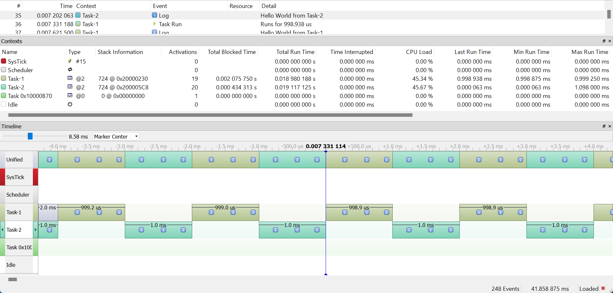

    <i>
    Pre-emptive scheduling captured in the SEGGER SystemView
    </i>

* Preemptive multitasking forces apps to share the processor, whether they want to or not. In the above case, "Hello World" is printed as many times as possible until the OS switches to the next scheduled task at the scheduling RTOS tick rate (1ms)

    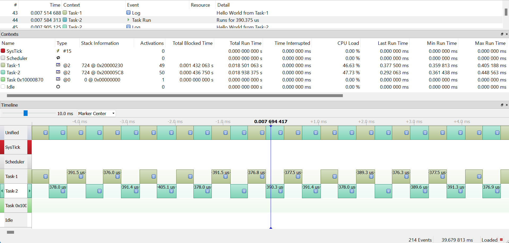

    <i>
    Cooperative scheduling captured in the SEGGER SystemView
    </i>

* In cooperative scheduling the OS never interrupts a running process to initiate a context switch from one process to another. Processes must voluntarily yield control periodically or when logically blocked on a resource. In the above scenario, the code was written in such a way that once "Hello World" was printed, the CPU would be voluntarily yielded by the task.

## Non-Blocking Delay (002LED_Tasks)
In this example, the tasks being run are:
* Green LED delay - 1000ms
* Red LED delay - 800ms
* Blue LED delay - 400ms
* RTOS tick - 100ms

    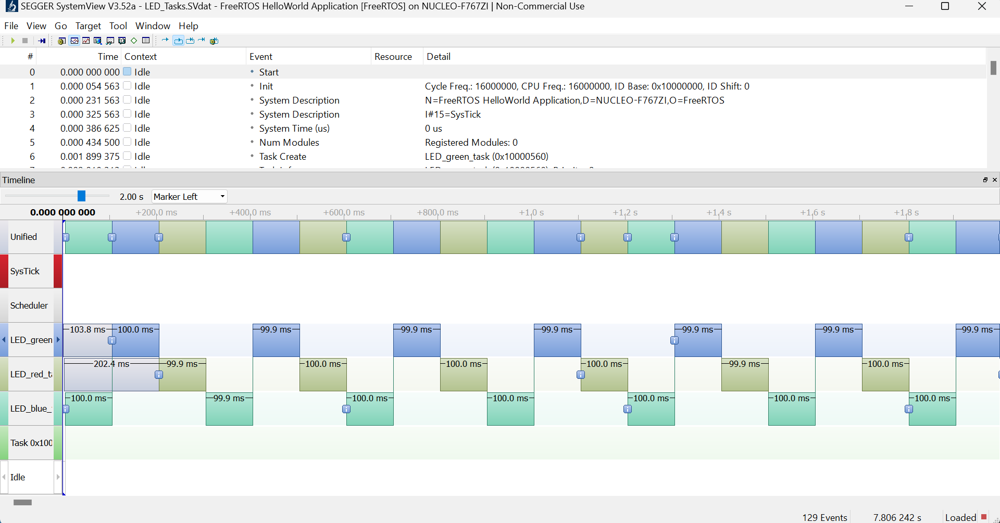

    <i>
    LED task NON-blocking scheduling captured in the SEGGER SystemView
    </i>

* This example achieves the desired delays using the HAL_DELAY API.
* These tasks are known as continuous tasks because, despite having nothing to do during some executions, they continue to demand resources from the CPU. Consequently, the CPU was never free, leading the micrcontroller to consume large amounts of current.

## FreeRTOS Blocking Delay API's (003LED_Blocking_Tasks & 004LED_Periodic_Tasks)

### FreeRTOS API's
* [vTaskDelay()](https://www.freertos.org/a00127.html) - Specifies a wake time relative to the time at which the function is called
* [vTaskDelayUntil()](https://www.freertos.org/vtaskdelayuntil.html) - Specifies the absolute (exact) time at which it wishes to unblock. The parameter in vTaskDelayUntil is the absolute time in ticks at which you want to be woken calculated as an increment from the time you were last woken.

    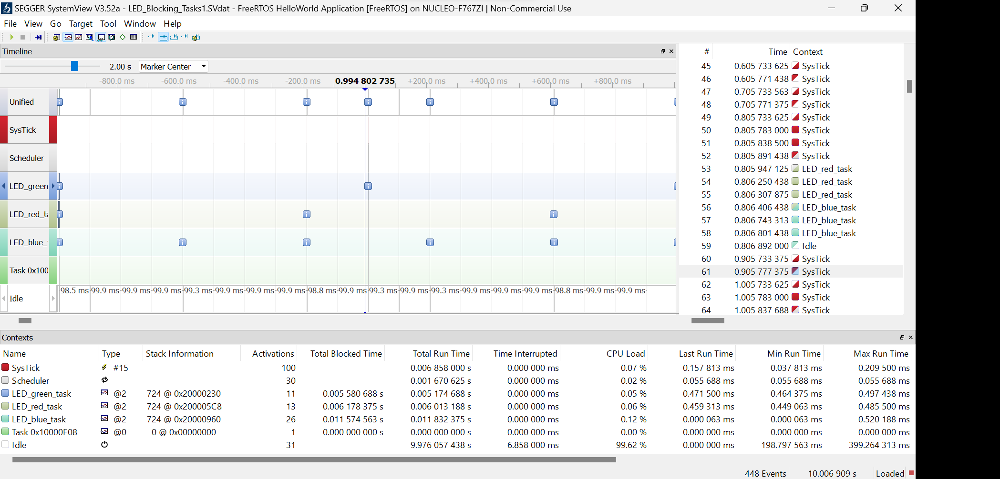

    <i>
    LED task blocking (vTaskDelay()) scheduling captured in the SEGGER SystemView
    </i>

* In this example, the vTaskDelay() function is called, allowing the CPU resources to be freed up once the task is completed. Notice how the idle time now occupies 99% of the time.
* vTaskDelay() will cause a task to block for the specified number of ticks from the time vTaskDelay() is called. It is therefore difficult to use vTaskDelay() by itself to generate a fixed execution frequency as the time between a task unblocking following a call to vTaskDelay() and that task next calling vTaskDelay() may not be fixed [the task may take a different path through the code between calls, or may get interrupted or preempted a different number of times each time it executes].

## FreeRTOS Notifications (005LED_TASK NOTIFY)
In this example, the tasks being run are:
1. Green LED Task
    * Toggle Period: 1000ms
    * Priority: 3
2.  Red LED Task
    * Toggle Period: 800ms
    * Priority: 2    
3.  Blue LED Task
    * Toggle Period: 400ms
    * Priority: 1
4.  User Button 13 Task
    * Polling every 10ms
    * Priority: 4
    * When the user button is pressed the highest priority LED task is run and deleted.

### FreeRTOS API's
#### RTOS Notification API's
* [Task Notifications](https://www.freertos.org/RTOS-task-notifications.html)
* [xTaskNotify()](https://www.freertos.org/xTaskNotify.html) - xTaskNotify() is used to send an event directly to and potentially unblock an RTOS task, and optionally update one of the receiving task’s notification values.
* [xTaskNotifyWait()](https://www.freertos.org/xTaskNotifyWait.html) -  xTaskNotifyWait() waits, with an optional timeout, for the calling task to receive a notification. If the receiving RTOS task was already Blocked waiting for a notification when the notification it is waiting for arrives the receiving RTOS task will be removed from the Blocked state and the notification cleared.

#### RTOS Suspend API's
* [vTaskSuspendAll()](https://www.freertos.org/a00134.html) - Suspends the scheduler.  Suspending the scheduler prevents a context switch from occurring but leaves interrupts enabled.  If an interrupt requests a context switch while the scheduler is suspended, then the request is held pending and is performed only when the scheduler is resumed (un-suspended).
* [xTaskResumeAll()](https://www.freertos.org/a00135.html) - Resumes the scheduler after it was suspended using a call to vTaskSuspendAll().

#### RTOS Creation API's
* [vTaskDelete](https://www.freertos.org/a00126.html) - Remove a task from the RTOS kernels management. The task being deleted will be removed from all ready, blocked, suspended and event lists.

    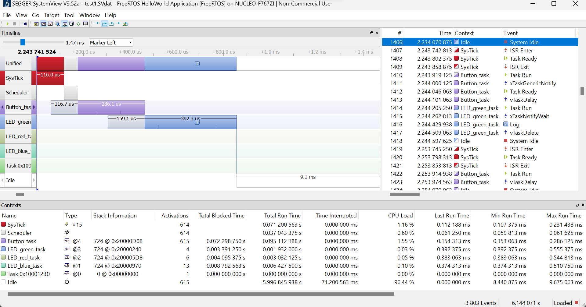

    <i>
    LED notification scheduling captured in the SEGGER SystemView
    </i>

In the above snapshot...
1. The scheduler tick is running every 10ms.
2. The Button_task runs and detects the user button has changed states (ON from rising edge).
3. The Button_task calls the function <i>xTaskNotify(next_task_handle,0,eNoAction)</i>, which sends a notification to the task with the task handle next_task_handle.
4. The scheduler runs the next available task, which is the LED_green_task.
5. The green LED is toggled.
6. The LED_green_task calls the function xTaskNotifyWait(0,0, NULL, pdMS_TO_TICKS(1000)) and notices that it has received a notification from another task.
7. The LED_green_task enters a block of code which turns on the green LED, suspends the scheduler, sets the next_task_handle, resumes the scheduler, and then deletes the current LED_green_task.
8. Then the scheduler returns to it's idle state until the next tick.

## FreeRTOS ISR API's (006LED_Btn_ISR)
The goal of this example is exactly the same as the previous one, with one key difference. For the button programming, we are going to use a hardware button interrupt handler rather than a scheduled task.
* By providing ISR APIs, FreeRTOS offers a mechanism for safely interacting with the RTOS kernel from within interrupt context.

### FreeRTOS API's
* [xTaskNotifyFromISR](https://www.freertos.org/xTaskNotifyFromISR.html) - Versions of xTaskNotify() and xTaskNotifyIndexed() that can be used from an interrupt service routine (ISR).
* [traceISR_ENTER()](https://www.freertos.org/rtos-trace-macros.html) - Helps the SEGGER system viewer trace that we have entered an interrupt.
* [portENTER_CRITICAL()](https://www.freertos.org/taskENTER_CRITICAL_taskEXIT_CRITICAL.html) - In this example, this function is used because we are modifying a variable that is shared between tasks and an interrupt. This allows us to disable (<b>KERNEL</b>) interrupts before changing the variable.

### Hardware Interrupts vs Kernel Interrupts
* The ARM Cortex M7 has 16 priority levels ranging from 0x00 to 0xF0. 0x00 represents the highest priority, while 0xF0 represents the lowest priority.
* The macro <i>configMAX_SYSCALL_INTERRUPT_PRIORITY</i> determines the highest priority level value that an interrupt routine using "FromISR" can use.
* Interrupts that do not call API functions can execute at priorities above the macro <i>configMAX_SYSCALL_INTERRUPT_PRIORITY</i> and therefore never be delayed by the RTOS.

### Configuring EXTI line interrupt
* <i>006_LED_BTN_ISR.ioc -> System Core -> NVIC -> EXTI 15_10 interrupt -> Preemption Priority </i>
* Pick a priority level that is lower than the macro <i>configMAX_SYSCALL_INTERRUPT_PRIORITY</i>.

    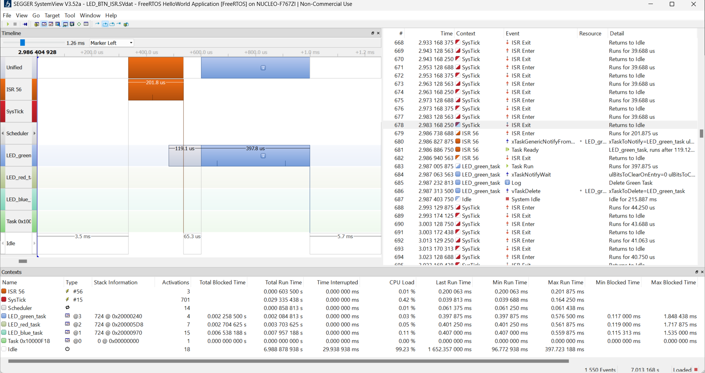

    <i>
    LED button ISR scheduling captured in the SEGGER SystemView
    </i>

In the above snapshot...
1. The scheduler tick runs every 10ms.
2. The user button is pressed which triggers an interrupt.
3. The interrupt handler runs the button handler function. 
4. The button handler function calls xTaskNotifyFromISR(next_task_handle, 0, eNoAction, &pxHigherPriorityTaskWoken), which sends a notification to the next_task_handle (in this case, it is LED_green_task).
    * <i>&pxHigherPriorityTaskWoken</i> - xTaskNotifyFromISR() will set *pxHigherPriorityTaskWoken to pdTRUE if sending the notification caused a task to unblock, and the unblocked task has a priority higher than the currently running task.
    * If this parameter were set to NULL, the scheduler would have continued to run the previously running idle task, despite the LED_green_task being of higher priority and in the ready state. This would result in LED_green_task being executed during the next scheduler tick rather than immediately.
5. portYIELD_FROM_ISR(pxHigherPriorityTaskWoken) causes the scheduler to initiate a context switch to run the next highest priority task that is ready.
6. The LED_green_task is run.
7. The green LED is toggled.
8. The LED_green_task calls the function xTaskNotifyWait(0,0, NULL, pdMS_TO_TICKS(1000)) and notices that it has received a notification from another task.
9. The LED_green_task enters a block of code that turns on the green LED, suspends the scheduler, sets the next_task_handle, resumes the scheduler, and then deletes the current LED_green_task.
10. The scheduler returns to its idle state until the next tick.

## Task Priority Exchange (007Task_Priority)
In this example, the tasks being run are:
Task 1
* Priority: 2
* A continuous task that toggles the green led with a period of 100ms.

Task 2
* Priority: 3
* A continuous task that toggles the red led with a period of 1000ms.

* When the user button is pressed, the priority of both tasks should be exchanged

### FreeRTOS API's
* [xTaskGetHandle()](https://www.freertos.org/a00021.html#xTaskGetHandle) - Looks up the handle of a task from the task's name.
* [uxTaskPriorityGet()](https://www.freertos.org/a00128.html) - Obtain the priority of any task.
* [vTaskPrioritySet](https://www.freertos.org/a00129.html) - Set the priority of any task. A context switch will occur before the function returns if the priority being set is higher than the currently executing task.

    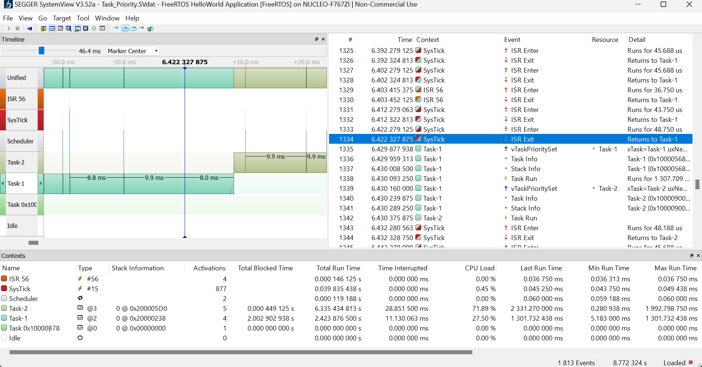

    <i>
    Task priority exchange captured in the SEGGER SystemView
    </i>

In the above snapshot...
1. ISR56 is a hardware interrupt triggered by the user button. It manipulates a global variable to indicate that a priority swap is desired.
2. The scheduler tick continues to run every 10ms but doesn't trigger a context switch because a hardware delay (HAL_DELAY()) of 1000ms is invoked every time Task 1 is called.
3. At the end of the HAL_DELAY(), the scheduler tick is executed, but Task 1 continues to run because it has a higher priority.
4. Since the global variable indicating a priority swap has been set, Task 1 will execute a section of code to swap the priority values of Task 1 and Task 2.
5. The scheduler then executes the next highest priority task, which is now Task 2.

### Other FreeRTOS API's to explore
* [Hook Functions](https://www.freertos.org/a00016.html) - FreeRTOS hook functions can be called from certain RTOS events. The most common is from the idle hook task. The idle hook function is an ideal place to put the processor into a low power state - providing an automatic power saving whenever there is no processing to be performed.

## FreeRTOS Queues and Timers (008Queues_n_Timers)
The following example is a FreeRTOS application that receives input (commands) from the user over UART and manages the LED and real-time clock (RTC) peripherals of the microcontroller.

    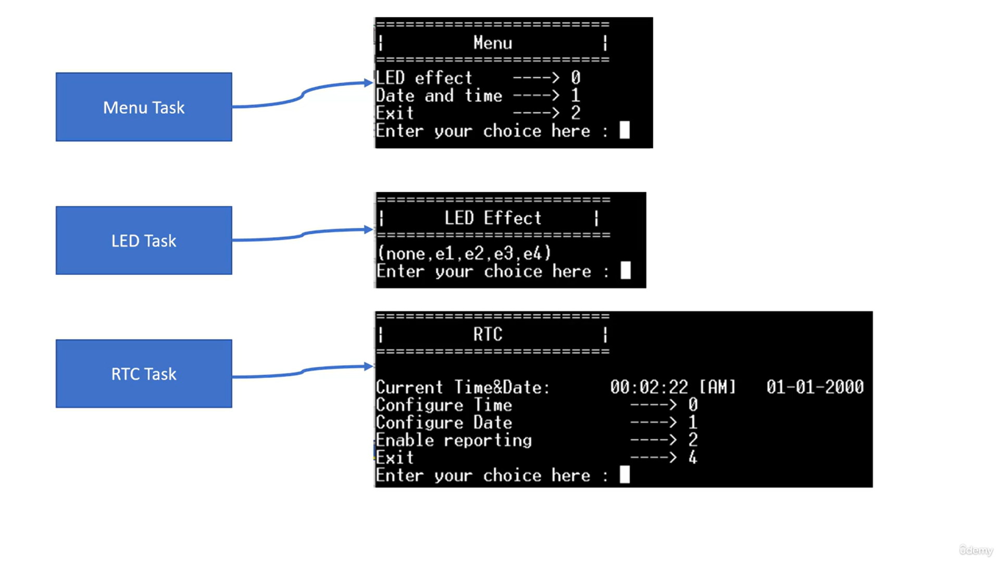

    <i>
    Example 008 Menu's
    </i>

    

    <i>
    Example 008 State Machine Diagram
    </i>

### FreeRTOS API's
* [FreeRTOS Queues](https://www.freertos.org/Embedded-RTOS-Queues.html)
* [FreeRTOS Timers](https://www.freertos.org/FreeRTOS-Software-Timer-API-Functions.html)

    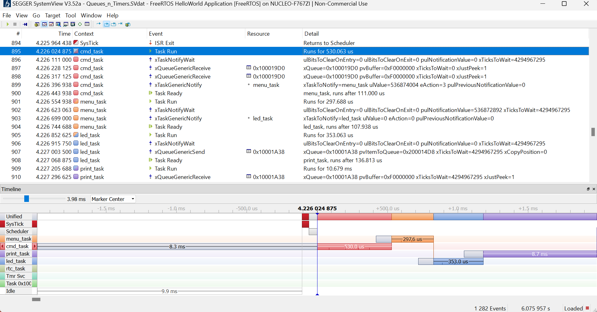

    <i>
    Example 008 receiving LED task command (e4) captured in the SEGGER SystemView
    </i>

* In this example, the status of queues is utilized to transmit data and trigger context switches between tasks.
* Additionally, FreeRTOS software timers are used for the LED effects.

## FreeRTOS Binary Semaphores (009Bin_Sema_Task)
The following example utilizes binary semaphores to synchronize two tasks. In this scenario, there are two tasks: a manager task and an employee task.
* Employee task
    1. The employee will check if the manager has assigned it a job (Check for binary semaphore).
    2. The employee will check if the manager has sent valid data for the job (Check the queue for data).
    3. The employee will receive a random number between 10 and 50 (from the manager) and will execute a task delay for that many milliseconds to simulate a job being done.
    4. Once the job has been completed it will notify the manager task (Return binary semaphore).
* Manager task
    1. The manager will check if the employee is busy (Check for binary semaphore).
    2. The manager will generate a random number between 10-50 if the employee is not busy.
    3. The manager will then send it to a queue for the employee to check. 
    4. The manager task will then yield itself until the employee has completed its task and returned the semaphore.

It is important to note that this example has been designed to use the semaphore to trigger context switching rather than the contents of the queue.

*Note 'Task Notifications' can provide a light weight alternative to binary semaphores in many situations*

### FreeRTOS API's
* [FreeRTOS Binary Semaphores](https://www.freertos.org/Embedded-RTOS-Binary-Semaphores.html)

    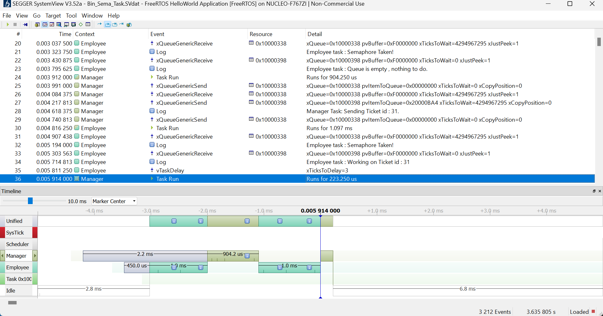

    <i>
    Binary Semaphore captured in the SEGGER SystemView
    </i>

In the above snapshot...
1. The employee acquires the available semaphore and checks the queue for data. Since no data is available, the employee releases the semaphore and yields its task.
2. The manager task executes and acquires a semaphore. It generates a random number between 10 and 50 and places it into the queue.
3. The manager releases the semaphore and yields its task, triggering a context switch to the employee task.
4. The employee acquires the available semaphore and retrieves the data from the queue.
5. The employee task executes a job that takes the same amount of time as the randomly generated number.
6. While the employee performs its task, the manager task blocks itself because no semaphore is available.
6. The employee completes its job and releases the semaphore.

## FreeRTOS Counting Semaphores (010Count_Sema_Task)
The following example uses counting semaphores to process latched events (by the handler task) sent by fast triggering interrupts.

### RTOS API's Used
* [FreeRTOS Semaphores](https://www.freertos.org/a00113.html)

    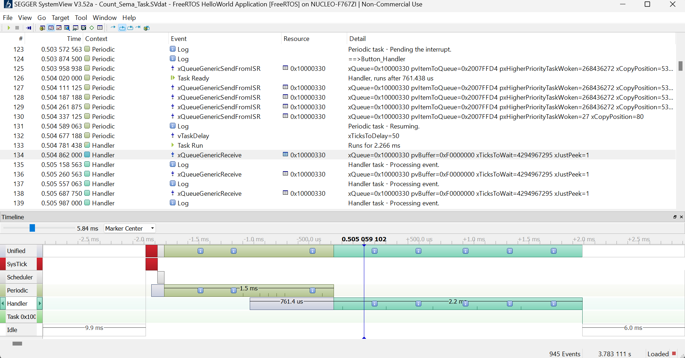

    <i>
    Counting Semaphores captured in the SEGGER SystemView
    </i>

In the above snapshot...
1. An interrupt handler is triggered.
2. The interrupt handler increments the semaphore count five times before blocking itself. This was done to simulate rapid successive interrupts that may occur before the semaphore handler executes.
3. The handler function runs by grabbing an available semaphore. This step occurs five times because 5 semaphores were made available. Once all five semaphores have been consumed, the task blocks itself. 

## FreeRTOS Mutual Exclusion  (011Mutex_API)
The following example uses mutexes to protect data or other resources from concurrent access. In this scenario, the shared resource is the UART transmit buffer. Without a mutex, the tasks would interrupt each other as they attempt to transmit data over UART. If you disable the mutex, you can observe this behavior through the REALTERM UART port. Without mutexes, the tasks mix and match their transmissions, causing interference.

3 ways to protect critical sections
* Binary semaphore
* Mutex
* Crude way (disabling interrupts of the system, either globally, or up to a specific interrupt priority level)

### Advantages of Mutex over Binary Semaphore
* Priority inheritance - Mutexes are able to avoid the problems of priority inversion through a priority inheritance feature.
* You can learn more about priority inversion here --> [Introduction to RTOS - Solution to Part 11 (Priority Inversion)](https://www.digikey.ca/en/maker/projects/introduction-to-rtos-solution-to-part-11-priority-inversion/abf4b8f7cd4a4c70bece35678d178321)

### FreeRTOS API's
* [FreeRTOS Semaphore Mutex](https://www.freertos.org/CreateMutex.html)

    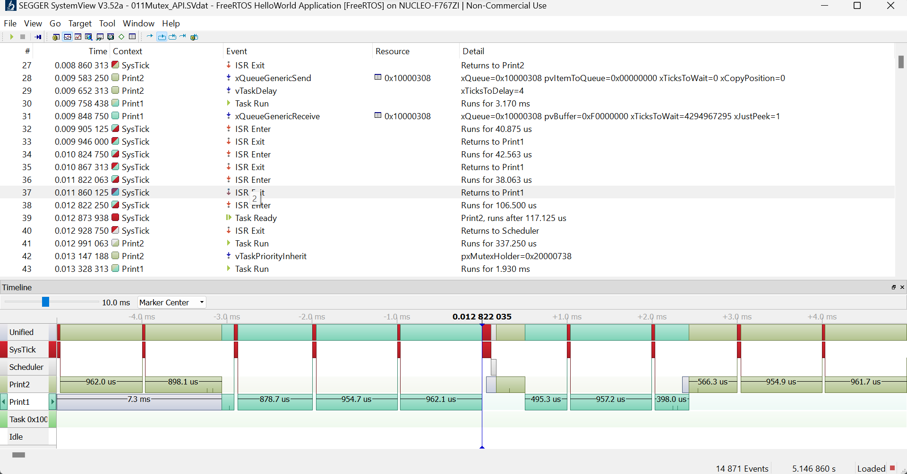

    <i>
    Mutual Exclusion captured in the SEGGER SystemView
    </i>

In the above snapshot...
1. Task 2 (higher priority) finishes running and triggers a blocking delay for 4ms.
2. Task 1 runs and begins transmitting over UART.
3. At the end of the 4ms delay Task 2 is ready to run.
4. Task 1 hasn't completed transmitting over UART. Using mutexes, it prevents Task 2 from running by implementing priority inheritance (increasing Task 1's priority to the same priority as Task 2), which allows Task 1 to complete its UART transmission.

# Resources
* [FreeRTOS Emulator](https://www.freertos.org/FreeRTOS-Windows-Simulator-Emulator-for-Visual-Studio-and-Eclipse-MingW.html)
